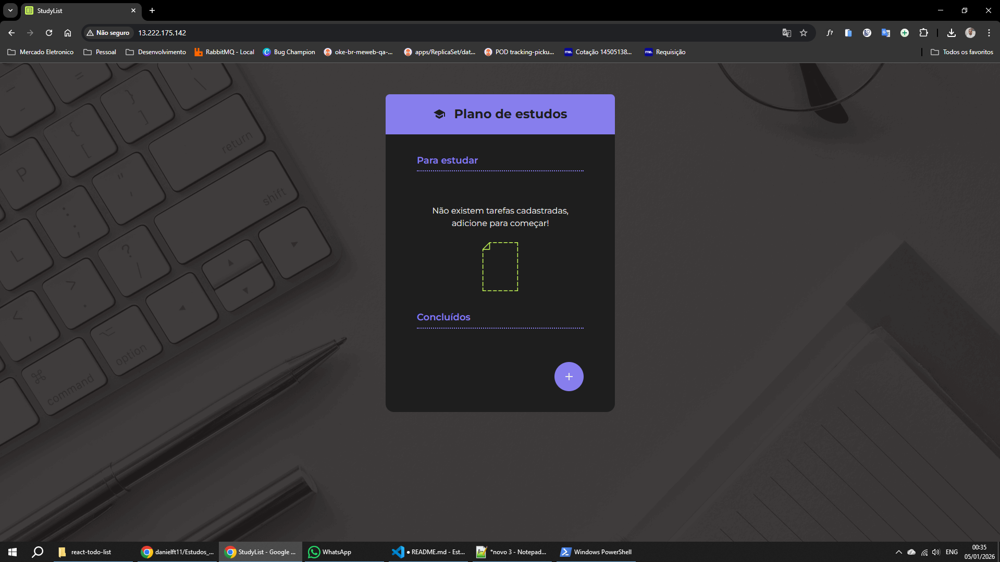

## 🚀 Laboratório AWS 01: Deploy de site estático em EC2 com S3 e IAM Role

### 🎯 Visão Geral

#### O que vamos construir?

Vamos construir uma arquitetura simples e intencionalmente manual para entender os fundamentos da AWS antes de escalar ou automatizar.

Construiremos:

- Um bucket S3 para armazenar o artefato de build de uma aplicação React estática.
- Uma política IAM com least privilege, permitindo apenas leitura do conteúdo do bucket.
- Uma IAM Role associada a uma instância EC2, evitando o uso de access keys na instância.
- Uma instância EC2 (Amazon Linux) com Nginx, responsável apenas por servir arquivos estáticos.

Um fluxo de deploy onde:

- o build da aplicação é gerado localmente, enviado ao S3 e consumido pela instância EC2 via IAM Role.

⚠️ **IMPORTANTE**: Este laboratório não representa a arquitetura ideal para publicar um site estático real em produção. Em um cenário profissional, o recomendado seria hospedar o conteúdo diretamente no Amazon S3, expor o site por meio do Amazon CloudFront como CDN, utilizando HTTPS, cache distribuído globalmente, melhor performance, menor custo operacional e maior segurança, possivelmente com AWS WAF e controle de acesso via Origin Access Control (OAC). A abordagem adotada neste laboratório (EC2 + Nginx consumindo arquivos do S3) foi intencionalmente escolhida para fins didáticos, com o objetivo de exercitar na prática conceitos fundamentais cobrados na certificação AWS Certified Developer – Associate (DVA-C02), como IAM (roles e policies), EC2, permissões de acesso a serviços, deploy manual, e entendimento do fluxo entre serviços, mesmo não sendo a solução mais eficiente para produção.

#### 📦 Etapas:

**Passo 1**: Criar a política chamada *S3ReadStaticSitePolicy*. Veja o conteúdo da política no arquivo **policy.txt**.

**Passo 2**. Criar a função (IAM Role) chamada *EC2StaticSiteRole* e anexar a política *S3ReadStaticSitePolicy* a essa função. Definir AWS Service como entidade confiável e EC2 como caso de uso.

**Passo 3.**
    
- 3.1. Criar um bucket S3 chamado, por exemplo, *amazn-static-react-site* com ACL desabilitada (padrão moderno), acesso público bloqueado, versionamento desabilitado e criptografia padrão (SSE-S3). 

- 3.2. Agora que o bucket já está criado acesse a política *S3ReadStaticSitePolicy* e edite-a definindo o nome correto do bucket nos Resources.

**Importante**: Policies são versionadas e podem ser atualizadas sem recriar roles ou recursos.

**Passo 4**. Criar um IAM User (temporário) que servirá para fazer upload do site da máquina local para o bucket S3. 

**Importante**: não deve ser confundido IAM User com IAM Role, pois IAM User é usado na máquina local, no exemplo, para fazer upload dos arquivos, e IAM Role é usado na instância EC2.

- 4.1. Acesse IAM / Users / Create User

- 4.2. Dê o nome *upload-user* para o usuário.

- 4.3. Crie uma política chamada *S3UploadStaticSitePolicy* e adicione a ela o conteúdo do arquivo **policy_upload_site.txt**. Observe que o nome do recurso (resource) é o nome do bucket S3 criado no passo 3.

- 4.4. Após o usuário criado acesse-o e vá em **Credenciais de Segurança (Security-Credentials)** e clique em Criar chave de acesso (Create access key). Selecione o tipo **Command Line Interface (CLI)** e confirme a criação. Copie a chave de acesso e a chave de acesso secreta para umlocal seguro, pois elas serão necessárias posteriormente.

**Passo 5. Build do site em React.**

- 5.1. Na raiz do projeto, na máquina local, digite os comandos abaixo:

  **npm install**

  **npm run build**

- 5.2. Será gerada a pasta dist/ ou build/.

- 5.3. No PowerShell ou terminal digite **aws configure** e informe o Access Key ID, Secret Access Key, Region (mesma do bucket) e o Output format como json (ou pode deixar em branco sem digitar nada)

- 5.4. Dentro da pasta do projeto (onde está dist ou build) digite **aws s3 sync dist/ s3://amazn-static-react-site/**

**Passo 6: Criar a instância EC2 (com IAM Role)**

- 6.1. Acessar EC2 / Instâncias / Executar Instâncias para criar a instância.

- 6.2. Nomear a instância como *ec2-static-site*.

- 6.3. Selecionar a imagem **AMI do Amazon Linux 2023**

- 6.3. Selecionar o tipo **t3.micro**, que para esse exemplo é qualificado para o nível gratuito (Free Tier).

- 6.4. Em **Perfil da Instância do IAM** selecionar a Role EC2StaticSiteRole criada no passo 2.

- 6.5. Editar Configurações de Rede e Habilitar a opção **Atribuir IP público automaticamente**.

- 6.6. Criar um Grupo de Segurança conforme abaixo. Você pode nomeá-lo ou deixar com o nome padrão sugerido pela AWS:
    Tipo	Porta	Origem
    SSH	22	        Seu IP
    HTTP	80	    0.0.0.0/0

- 6.7. Em **Par de chaves (login)** crie um novo par de chaves com o nome **ec2-static-site-key** do tipo RSA e formato .pem. Faça o download do arquivo .pem.

- 6.8. Clique em Executar instância (Launch instance) para finalizar a criação da instância. Aproveite e copie o IP público da instância.

**Passo 7: Deploy do site (Nginx + S3 Sync)**
    
Aqui vamos:

- Instalar Nginx
- Sincronizar o conteúdo do S3
- Servir o React via HTTP

7.1. No PowerShell (ou terminal que você já usou) certifique-se que você está na mesma pasta onde fez download do arquivo .pem e digite o comando abaixo. Troque @SEU_IP_PUBLICO pelo IP público da instância EC2: 

**ssh -i C:\Users\Daniel\Desktop\ec2-static-site-key.pem ec2-user@SEU_IP_PUBLICO**

7.2. Confirme que entrou como ec2-user

7.3. Atualize o sistema com o comando **sudo dnf update -y**. Esse comando utiliza o gerenciador de pacotes **dnf** do Amazon Linux 2023 para instalar e atualizar programas e resolver dependências.

7.4. Instale o Nginx com o comando **sudo dnf install nginx -y**.

7.5. Inicie e habilite o Nginx com os comandos abaixo:

**sudo systemctl start nginx**
    
**sudo systemctl enable nginx**

7.6. Teste a execução do Nginx com o comando **systemctl status nginx**. Estado esperado: active (running).

7.7. Teste o Nginx no navegador digitando **http://SEU_IP_PUBLICO**. Se aparecer a página padrão do Nginx, está tudo certo até aqui.

7.8. Limpe o diretório padrão do Nginx com o comando **sudo rm -rf /usr/share/nginx/html/***

7.9. Sincronize o site do S3 para a EC2 com o comando abaixo. Como a EC2 já tem IAM Role, não precisa de access key:

**sudo aws s3 sync s3://SEU_BUCKET_CORRETO /usr/share/nginx/html/**

7.10. Ajuste as permissões (se necessário) com os comandos abaixo:

**sudo chown -R nginx:nginx /usr/share/nginx/html**

**sudo chmod -R 755 /usr/share/nginx/html**

7.11. Reinicie o Nginx com o comando **sudo systemctl restart nginx**

7.12. Finalmente, abra novamente o endereço http://SEU_IP_PUBLICO. Seu app deve estar sendo carregado normalmente conforme imagem abaixo:

### 🗑️ Exclusão de Recursos para não haver cobranças:

Ao final do tutorial é importante realizar a remoção dos recursos abaixos para não haver cobranças surpresas por parte da AWS:

**Instância EC2**: acessar EC2 / Instâncias / selecionar a instância e clicar em **encerrar (excluir instância). Mesmo após excluída a instância demora um tempo para desaparecer. Certifique-se de que o estado da mesma esteja como **encerrado** caso ela esteja aparecendo, dessa forma não haverá cobrança.

**Volumes**: acessar EC2 / Volumes. Normalmente o volume é deletado automaticamente junto com a instância, mas, caso esteja aparecendo, selecione o volume e exclua-o.

**Grupos de Segurança (Security Groups)**: acesse EC2 / Rede e Segurança / Security Groups e exclua o grupo criado. 

📌 Security Group não gera custo, mas limpar evita confusão.

**Bucket S3**: acesse S3 / Buckets. Esvazie o bucket existente e depois delete-o.

**IAM Policy**: acesse IAM / Gerenciamento de Acesso / Políticas / filtre pelo tipo **Gerenciadas pelo cliente** e apague as políticas que foram criadas.

📌 Também não gera custo, mas limpar evita confusão.

**IAM Role**: acesse IAM / Gerenciamento de Acesso / Funções, selecione a função criada e delete-a.

📌IAM Role não gera custo, mas é boa prática limpar.

**IAM User (se criado só para o lab)**: acesse IAM / Gerenciamento de Acesso / Usuários, selecione o usuário criado e remova-o.

📌 IAM não cobra, mas chave esquecida = risco.

**Par de chaves (Key Pair)**: acesse EC2 / Rede e segurança / Pares de chaves, selecione o par de chaves criado e remova-o.

📌 Não gera custo, mas mantém o ambiente limpo.

